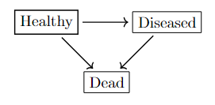
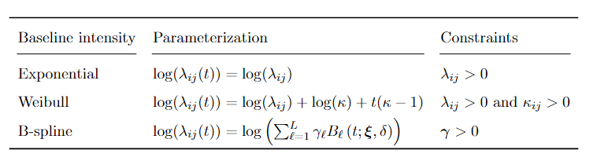

```{r setup, include = FALSE}
knitr::opts_chunk$set(
  collapse = TRUE,
  warning=FALSE, 
  message=FALSE,
  comment = "#>"
)
set.seed(1)
```


# Overview

Note that if you would like to extract the code directly from this document into an R script, the following command can be ran:

```{r, class.source='fold-show', eval=F}
knitr::purl(input="illness-death.Rmd")
```


This vignette demonstrates how to simulate from and fit an illness-death model using the `MultistateModelsPaper` R package, 
which is based on the `MultistateModels.jl` Julia package. 
This version of the package is a stable version used to accompany the paper
"Assessing treatment efficacy for interval censored endpoints using multistate semi-Markov models fit to multiple data streams".
In this simple setting, patients are healthy at the start of follow-
up. The model has three states – healthy, ill, and dead – and three transitions — healthy to ill,
healthy to dead, and ill to dead. Disease recurrence is interval censored but the time
of death is exactly observed.


```{r, echo=FALSE, fig.cap="Direct transitions between states in a progressive illness-death model.", purl=F}

```


In this example, clinical histories for 250 participants are simulated in a hypothetical study using a 
progressive illness-death model with Weibull transition intensities with shape parameter greater than 1, so each
intensity was 0 at the time of state entry and increased over time. Clinical data was accrued at
baseline, which was the time of entry into the healthy state, and at random times spaced spaced
roughly every 1 month over 1 year of follow-up. 

# Installation and Setup

First, ensure `Julia` (<span>&#8805;</span> version 1.10) is installed. Julia can be downloaded from https://julialang.org/downloads/. Julia must be added to the system PATH; instructions can be found here: https://julialang.org/downloads/platform/. After installing Julia, ensure that the `JuliaConnectoR` R package has been installed and loaded. This package depends on having R version <span>&#8805;</span> 3.2).

```{r, class.source='fold-show'}
#install.packages("JuliaConnectoR")
library(JuliaConnectoR)
```

`dplyr`, `ggplot2`, `knitr`, and `kableExtra` are also required for this vignette:

```{r, class.source='fold-show'}
#install.packages("dplyr")
#install.packages("ggplot2")
#install.packages("knitr")
#install.packages("kableExtra")
library(ggplot2)
library(dplyr)
```

The necessary Julia functions can be installed by running the following code:

```{r, class.source='fold-show', warning=FALSE, message=F}
if (JuliaConnectoR::juliaSetupOk()){
    JuliaConnectoR::juliaEval('
       import Pkg
       Pkg.add(url = "https://github.com/fintzij/MultistateModels.jl.git")
       Pkg.add("CSV")
       Pkg.add("DataFrames")
       Pkg.add("Random")')
  } else {
    stop("Julia setup incorrect.
         Ensure Julia version >= 1.10 is properly installed.")
  }
```


If there is an error, it means that Julia has not been installed correctly. See the help page for the `JuliaConnectoR-package` for more details. 

You can install MultistateModelsPaper from
[GitHub](https://github.com/) with:

```{r, class.source='fold-show', warning=FALSE, message=FALSE}
#install.packages("devtools")
devtools::install_github("ammateja/MultistateModelsPaper", quiet=TRUE)
library(MultistateModelsPaper)
```

# Illness death model


The function `makepars` (click to show code) sets the Weibull baseline intensities for all three transitions. 
The parameters are shown in the table below:

```{r, echo=FALSE, fig.cap="Parameterization and parameter values for transition intensities in the simulation model.", purl=F}

```


```{r}
#Function to make parameters
makepars <- function() {
  parameters <- list(h12 = c(log(1.25), log(1.5)), 
                     h13 = c(log(1.25), log(1)), 
                     h23 = c(log(1.25), log(2)))
  return(parameters)
}
```

The function `make_obstimes` (click to show code) creates visit times for each participant. 
Participants are followed for one year and their clinical status is observed at
monthly increments. We add some variation around the scheduled assessment
time to better emulate a real-world study. The random visit times are drawn from a beta(1.5, 1.5)
distribution centered around the scheduled time and scaled to span the midpoints between scheduled
assessments, e.g., an individual’s visit time for month 2 would be drawn as 2 + (rbeta(1, 1.5, 1.5) - 0.5). 
The time of enrollment and end of follow-up were 0 and 1 year for all participants.

```{r}
#Function to make the assessment times
make_obstimes <- function(ntimes) {
  #observation times
  interval <- seq(0, 1, length.out = ntimes+1)
  # random visit times drawn from a beta(1.5, 1.5)
  #distribution centered around the scheduled time and scaled to span the midpoints between scheduled assessments
  times <- interval[-c(1, length(interval))] + (rbeta(length(interval[-c(1, length(interval))]), 1.5, 1.5) - 0.5)*diff(interval)[1]
  #time of enrollment and end of follow-up were 0 and 1 year for all
  times <- c(0, times, 1)

  return(times)
}
```

First, we  create a dataset of N=250 subjects. 
The dataset contains the observation times for each subject as described above. 
For this initial dataset, both `statefrom` and `stateto` are equal to 1, and `obstype` is equal to 2 (panel data). 


```{r}
#Initialize empty data frame and loop through each subject
set.seed(1)
data <- NULL
for (i in 1:250) {
  #create observation times
  visitdays <- make_obstimes(12)
  #set id
  id <- rep(i, 12)
  #Reformat dataset so each row has tstart and tstop
  tstart <- visitdays[-length(visitdays)]
  tstop <- visitdays[-1]
  #set statefrom and stateto to both be 1
  statefrom <- rep(1, 12)
  stateto <- rep(1, 12)
  #set obstype equal to 2
  obstype <- rep(2, 12)
  d <- data.frame(id=id, tstart=tstart, tstop=tstop, statefrom=statefrom, stateto=stateto, obstype=obstype)
  data <- rbind(data, d)
}
```

Once this initial dataset is established, a multistate model is initialized for simulation and the Weibull transition intensities are 
set to the starting values as described in `makepars` above.  

```{r}
#set all hazards to be Weibull
h12 <- MultistateModelsPaper::Hazard(formula = 0~1, statefrom = 1, stateto=2, family="wei")
h13 <- MultistateModelsPaper::Hazard(formula = 0~1, statefrom = 1, stateto=3, family="wei")
h23 <- MultistateModelsPaper::Hazard(formula = 0~1, statefrom = 2, stateto=3, family="wei")

#Initalize model
model <- MultistateModelsPaper::multistatemodel(hazard = c(h12, h13, h23), data=data)
#Starting parameters
parameters <- makepars()
#Set parameters
model_sim <- MultistateModelsPaper::set_parameters(model=model, newvalues=parameters)
```

Using that dataset, we simulate sample paths for each subject.

```{r}
JuliaConnectoR::juliaEval("using Random")
JuliaConnectoR::juliaEval("Random.seed!(0)")
#Simulate one sample path per subject
paths <- MultistateModelsPaper::simulate(model=model_sim, nsim=1, paths=TRUE, data=FALSE)
```


In `observe_subjdat` (click to show), we combine the observed visit times for each subject with
their simulated sample paths. For a transition between illness and death, we insert a ghost transition 
with time &epsilon; for model fitting. The transition between healthy and illness (state 1 to state 2) is a panel observation, 
and so for these transitions, obstype = 2 as the time of that transition is unknown.
The transition between illness and death (state 2 to state 3) happens in the interval (time of death – epsilon, time of death] and obstype = 1, 
as the transition is known to have occurred at the time of death exactly. 


We update the states to reflect the transitions between
the simulated paths, and cull redundant rows in the absorbing state (death).
`obstype` is set to 2 except for the transition is between states 2 and 3, which is directly observed and so
`obstype` is set to 1. 

```{r}
observe_subjdat <- function(path, model) {
  
  #Get data used in model and loop through each subject
  d <- as.data.frame(model$data)
  subjdat <- NULL
  
  for (i in 1:length(path)) {
    
    #Get observed visit times for one subject
    subj.dat.raw <- d[d$id == i, ]
    #Combine observed visit times with times from simulated sample paths --> sort and ensure all times are unique
    obstimes <- unique(sort(c(0, subj.dat.raw$tstop, path[[i]]$times[path[[i]]$states ==3])))
    
    #If there is a transition from state 2 to state 3, add ghost transition with time epsilon. Again ensure times are sorted
    if (sum(c(2,3) %in% path[[i]]$states) == 2) {
      
      new <- path[[i]]$times[length(path[[i]]$times)] - sqrt(.Machine$double.eps)
      obstimes <- sort(c(obstimes, new))
      
    }
    
    #Cull times greater than max time from simulated path
    obsinds <- unlist(lapply(obstimes, function(x){max(which(path[[i]]$times <= x))}))
    #Determine state at each observation time
    obsstates <- path[[i]]$states[obsinds]
    
    #Create dataset for one subject
    data <- data.frame(id = rep(path[[i]]$subj, (length(obstimes)-1)), 
                      tstart = obstimes[-length(obstimes)], 
                      tstop = obstimes[-1], 
                      statefrom = obsstates[-length(obsstates)], 
                      stateto = obsstates[-1])
    #Remove any data after death
    data <- data[data$stateto != 3 | data$statefrom != 3, ]
    #Set obstype to 2 unless death, then it is directly observed
    data$obstype <- ifelse(data$stateto == 3, 1, 2)
    data$obstype <- ifelse(data$statefrom == data$stateto, 1, data$obstype)
    
    subjdat <- rbind(subjdat, data)
    
  }
  
  subjdat <- subjdat %>% dplyr::arrange(id, tstart)
  
  return(subjdat)
  
}
```

```{r}
dat <- observe_subjdat(paths, model_sim)
```

The setup of this dataset is shown below: 


```{r, echo=FALSE, purl=F}
knitr::kable(dat, "html") %>% kableExtra::kable_styling() %>% kableExtra::scroll_box(width = "800px", height = "300px")
```


We can now re-create the model with the simulated data, according to one of the four parameterizations specified below. 
In this example, we use linear splines. 


```{r, echo=FALSE, fig.cap="Parameterization of transition intensities for illness-death models.", purl=F}

```

For each model, all transition intensities were assigned the same functional form. 
Two of the models were semi-parametric and used B-splines to approximate the baseline intensity for each transition. 
In the simple case, we used degree 1 B-splines, i.e., linear splines, with a single interior knot set at the
median observed transition time for each possible event. In the more complicated case, we used
natural cubic splines with interior knots at the 1/3 and 2/3 quantiles of the transition times for
each event. For the transition from ill to dead, we computed the quantiles for time from
recurrence to death by taking the left endpoint of the interval in which disease was known to have
recurred as the time of illness onset. In both spline models, the right boundary knot was set to the
greatest observed transition time, or the maximum of the right endpoints of the intervals in which
recurrence was known to have occurred in the case of the healthy to ill transition. We used a flat
extrapolation of the transition intensity beyond the right spline boundary.

We initialize parameters to set the starting values of the transition intensities to MLEs of the Markov model
and fit the model, which is now setup for inference. 


```{r}
#Obtain knots for each transition
#median observed transition time for each possible event
knots12 <- c(0, quantile(JuliaConnectoR::juliaLet("MultistateModels.extract_sojourns(1, 2, MultistateModels.extract_paths(dat))", dat=JuliaConnectoR::juliaCall("DataFrame", dat)), c(0.5, 1)))
knots13 <- c(0, quantile(JuliaConnectoR::juliaLet("MultistateModels.extract_sojourns(1, 3, MultistateModels.extract_paths(dat))", dat=JuliaConnectoR::juliaCall("DataFrame", dat)), c(0.5, 1)))
knots23 <- c(0, quantile(JuliaConnectoR::juliaLet("MultistateModels.extract_sojourns(2, 3, MultistateModels.extract_paths(dat))", dat=JuliaConnectoR::juliaCall("DataFrame", dat)), c(0.5, 1)))

#Set transition intensity for each transition to be a degree 1 spline, interior knot at median, and boundary knots at 0 and max    
h12_sp <- MultistateModelsPaper::Hazard(formula = 0~1, statefrom = 1, stateto=2, family="sp", degree=1, knots = knots12[-c(1, length(knots12))], boundaryknots = knots12[c(1, length(knots12))], extrapolation = "flat")
h13_sp <- MultistateModelsPaper::Hazard(formula = 0~1, statefrom = 1, stateto=3, family="sp", degree=1, knots = knots13[-c(1, length(knots13))], boundaryknots = knots13[c(1, length(knots13))], extrapolation = "flat")
h23_sp <- MultistateModelsPaper::Hazard(formula = 0~1, statefrom = 2, stateto=3, family="sp", degree=1, knots = knots23[-c(1, length(knots23))], boundaryknots = knots23[c(1, length(knots23))], extrapolation = "flat")

#Set up model
model_fit <- MultistateModelsPaper::multistatemodel(hazard = c(h12_sp, h13_sp, h23_sp), data=dat)
#initialize parameters to set the starting values of the transition intensities to MLEs of the Markov model
model_fit <- MultistateModelsPaper::initialize_parameters(model = model_fit)
#Fi the model
model_fitted <- MultistateModelsPaper::fit(model = model_fit, verbose=TRUE, compute_vcov = TRUE, ess_target_initial = 50, ascent_threshold = 0.2, stopping_threshold = 0.2, tol = 0.001)
```

In order to obtain the maximum likelihood estimates for functionals of interest, we simulate 20 paths per subject from this fitted model.


```{r}
JuliaConnectoR::juliaEval("Random.seed!(0)")
#Set up model for simulation with data from fitted model
model_sim2 <- MultistateModelsPaper::multistatemodel(hazard = c(h12_sp, h13_sp, h23_sp), data=as.data.frame(model_sim$data))

#Set parameters to MLEs of fitted model
model_sim2 <- MultistateModelsPaper::set_parameters(model = model_sim2, newvalues = list(JuliaConnectoR::juliaGet(model_fitted$parameters[1])$data, JuliaConnectoR::juliaGet(model_fitted$parameters[2])$data, JuliaConnectoR::juliaGet(model_fitted$parameters[3])$data))

#Simulate 20 paths per subject
paths_sim <- MultistateModelsPaper::simulate(model = model_sim2, nsim = 20, paths = TRUE, data = FALSE)
```

In this single example, we show prevalence in each compartment, and cumulative incidence of illness and death. 
Confidence intervals are obtained by summarizing sample paths simulated from the asymptotic distribution of the MLEs. 


```{r, echo=F}
times <- seq(0, 1, 0.05)
times_new <- seq(0, 1, 0.01)

intervals <- dplyr::bind_rows(lapply(paths, function(x){as.data.frame(cbind(times, rep(x$subj, length(times)), findInterval(times, x$times), x$states[findInterval(times, x$times)]))}))

times_summary <- intervals %>% dplyr::group_by(times, V4) %>% dplyr::summarize(n=n(), per=100*(n/length(paths)), .groups="drop")

intervals_mod <- dplyr::bind_rows(lapply(paths_sim, function(x){as.data.frame(cbind(times_new, rep(x$subj, length(times_new)), findInterval(times_new, x$times), x$states[findInterval(times_new, x$times)]))}))

times_summary_mod <- intervals_mod %>% dplyr::group_by(times_new, factor(V4), .drop=FALSE) %>% dplyr::summarize(n=n(), per=100*(n/length(paths_sim)), .groups="drop")
```


```{r, echo=F}
inc2 <- rep(1, length(paths))
inc3 <- rep(1, length(paths))

for (i in 1:length(paths)) {
  
  if (paths[[i]]$states[2] == 2) {
    inc2[i] <- paths[[i]]$times[2]
  } 
  
  if (3 %in% paths[[i]]$states) {
    inc3[i] <- max(paths[[i]]$times)
  }
  
}

times2 <- rep(0, length(times))

for (i in 1:length(times)) {
  times2[i] <- 100*mean(inc2 < times[i])
}

times3 <- rep(0, length(times))

for (i in 1:length(times)) {
  times3[i] <- 100*mean(inc3 < times[i])
}

incidence <- data.frame(times = rep(times, 2), incidence = c(times2, times3), state = c(rep(2, length(times)), rep(3, length(times))))


inc2_mod <- rep(1, length(paths_sim))
inc3_mod <- rep(1, length(paths_sim))

for (i in 1:length(paths_sim)) {
  
  if (paths_sim[[i]]$states[2] == 2) {
    inc2_mod[i] <- paths_sim[[i]]$times[2]
  } 
  
  if (3 %in% paths_sim[[i]]$states) {
    inc3_mod[i] <- max(paths_sim[[i]]$times)
  }
  
}

times2_mod <- rep(0, length(times_new))

for (i in 1:length(times_new)) {
  times2_mod[i] <- 100*mean(inc2_mod < times_new[i])
}

times3_mod <- rep(0, length(times_new))

for (i in 1:length(times_new)) {
  times3_mod[i] <- 100*mean(inc3_mod < times_new[i])
}

incidence_mod <- data.frame(times = rep(times_new, 2), incidence = c(times2_mod, times3_mod), state = c(rep(2, length(times_new)), rep(3, length(times_new))))

```

```{r, echo=F}
asymptotic_bootstrap_incidence <- function(model, pars, vcov, sims_per_subj, nboot) {
  
  npars <- length(pars)
  pardraws <- rep(0, npars)
  
  U <- svd(vcov)$u
  D <- svd(vcov)$d
  
  D[D < 0] <- 0
  
  S <- U%*%diag(sqrt(D))
  
  ests_inc2 <- matrix(0, nrow=length(times_new), ncol=nboot)
  ests_inc3 <- matrix(0, nrow=length(times_new), ncol=nboot)
  
  ests_prev1 <- matrix(0, nrow=length(times_new), ncol=nboot)
  ests_prev2 <- matrix(0, nrow=length(times_new), ncol=nboot)
  ests_prev3 <- matrix(0, nrow=length(times_new), ncol=nboot)
  
  for (k in 1:nboot) {
    
    pardraws[1:npars] <- as.matrix(pars) + S%*%rnorm(npars)
    
    elem_ptr <- JuliaConnectoR::juliaGet(model$parameters)$elem_ptr
    newvalues <- vector("list", length(elem_ptr)-1)
    for (i in 1:(length(elem_ptr)-1)) {
      newvalues[[i]] <- pardraws[elem_ptr[i]:(elem_ptr[i+1]-1)]
    }
    
    model <- MultistateModelsPaper::set_parameters(model=model, newvalues = newvalues)
    paths_sim <- MultistateModelsPaper::simulate(model=model, nsim = sims_per_subj, paths=TRUE, data=FALSE)
    
    inc2_mod <- rep(1, length(paths_sim))
    inc3_mod <- rep(1, length(paths_sim))

    for (i in 1:length(paths_sim)) {
  
      if (paths_sim[[i]]$states[2] == 2) {
        inc2_mod[i] <- paths_sim[[i]]$times[2]
      } 
  
      if (3 %in% paths_sim[[i]]$states) {
        inc3_mod[i] <- max(paths_sim[[i]]$times)
      }
  
    }

    times2_mod <- rep(0, length(times_new))

    for (i in 1:length(times_new)) {
      times2_mod[i] <- 100*mean(inc2_mod < times_new[i])
    }

    times3_mod <- rep(0, length(times_new))

    for (i in 1:length(times_new)) {
      times3_mod[i] <- 100*mean(inc3_mod < times_new[i])
    }

    ests_inc2[ ,k] <- times2_mod
    ests_inc3[ ,k] <- times3_mod
    
    intervals_mod <- bind_rows(lapply(paths_sim, function(x){as.data.frame(cbind(times_new, rep(x$subj, length(times_new)), findInterval(times_new, x$times), x$states[findInterval(times_new, x$times)]))}))

    times_summary_mod <- intervals_mod %>% group_by(times_new, factor(V4), .drop=FALSE) %>% dplyr::summarize(n=n(), per=100*(n/length(paths_sim)), .groups="drop")
    ests_prev1[ ,k] <- as.numeric(times_summary_mod[times_summary_mod$`factor(V4)` ==  1, ]$per)
    ests_prev2[ ,k] <- as.numeric(times_summary_mod[times_summary_mod$`factor(V4)` ==  2, ]$per)
    ests_prev3[ ,k] <- as.numeric(times_summary_mod[times_summary_mod$`factor(V4)` ==  3, ]$per)
    
  }
  

  
  return(list(t(apply(ests_inc2, 1, quantile, na.rm=T, probs = c(0.025))), t(apply(ests_inc2, 1, quantile, na.rm=T, probs = c(0.975))), t(apply(ests_inc3, 1, quantile, na.rm=T, probs = c(0.025))), t(apply(ests_inc3, 1, quantile, na.rm=T, probs = c(0.975))), 
              t(apply(ests_prev1, 1, quantile, na.rm=T, probs = c(0.025))), t(apply(ests_prev1, 1, quantile, na.rm=T, probs = c(0.975))), t(apply(ests_prev2, 1, quantile, na.rm=T, probs = c(0.025))), t(apply(ests_prev2, 1, quantile, na.rm=T, probs = c(0.975))), t(apply(ests_prev3, 1, quantile, na.rm=T, probs = c(0.025))), t(apply(ests_prev3, 1, quantile, na.rm=T, probs = c(0.975)))))
  
  
}
```

```{r, echo=F}
#JuliaConnectoR::juliaEval("Random.seed!(0)")
#set.seed(1)
#inc_cis <- asymptotic_bootstrap_incidence(model_sim2, JuliaConnectoR::juliaGet(model_fitted$parameters)$data, model_fitted$vcov, 20, 1000)

inc_cis <- readRDS("cis.RDS")
```

The plot below shows the prevalence in each compartment. 
Dots are from paths of the initial simulated data. Solid lines correspond to the pointwise 
maximum likelihood estimates and the shaded areas to the 95% pointwise confidence band based on 1,000 bootstrap samples.


```{r, fig.height=6, fig.width=8, echo=F}
ggplot() + 
  geom_point(data=times_summary, aes(x=times, y=per, col=factor(V4))) + 
  geom_line(data=times_summary_mod, aes(x=times_new, y=per, col=`factor(V4)`), lwd=1) + 
  geom_ribbon(data = data.frame(x=times_new, y1=as.numeric(inc_cis[[5]]), y2=as.numeric(inc_cis[[6]])), aes(x=x, ymin=y1, ymax=y2), fill="forestgreen", alpha=0.15) +
  geom_ribbon(data = data.frame(x=times_new, y1=as.numeric(inc_cis[[7]]), y2=as.numeric(inc_cis[[8]])), aes(x=x, ymin=y1, ymax=y2), fill="blue", alpha=0.15) +
  geom_ribbon(data = data.frame(x=times_new, y1=as.numeric(inc_cis[[9]]), y2=as.numeric(inc_cis[[10]])), aes(x=x, ymin=y1, ymax=y2), fill="darkred", alpha=0.15) +
  theme_bw() +
  scale_color_manual(values = c("forestgreen", "blue", "darkred"), labels = c("Healthy", "Ill", "Dead")) +
  labs(y = "Prevalence (%)", x = "Time", col = "State") +
  scale_x_continuous(breaks = seq(0, 1, 0.1)) +
  scale_y_continuous(limits = c(0, 100), breaks = seq(0, 100, 25))
```


The plot below shows the cumulative incidence of illness and death. 
Dos are from paths of the initial simulated data. Solid lines correspond to the pointwise 
maximum likelihood estimates and the shaded areas to the 95% pointwise confidence band based on 1,000 bootstrap samples.

```{r, fig.height=6, fig.width=8, echo=F}
ggplot() + 
  geom_point(data=incidence, aes(x=times, y=incidence, col=factor(state))) + 
  geom_line(data=incidence_mod, aes(x=times, y=incidence, col=factor(state)), lwd=1) +
  geom_ribbon(data = data.frame(x=times_new, y1=as.numeric(inc_cis[[1]]), y2=as.numeric(inc_cis[[2]])), aes(x=x, ymin=y1, ymax=y2), fill="blue", alpha=0.15) +
  geom_ribbon(data = data.frame(x=times_new, y1=as.numeric(inc_cis[[3]]), y2=as.numeric(inc_cis[[4]])), aes(x=x, ymin=y1, ymax=y2), fill="darkred", alpha=0.15) +
  theme_bw() +
  scale_color_manual(values = c("blue", "darkred"), labels = c("Ill", "Dead")) +
  labs(y = "Cumulative Incidence (%)", x = "Time", col = "State") +
  scale_x_continuous(breaks = seq(0, 1, 0.1)) +
  scale_y_continuous(limits = c(0, 100), breaks = seq(0, 100, 25))
```


